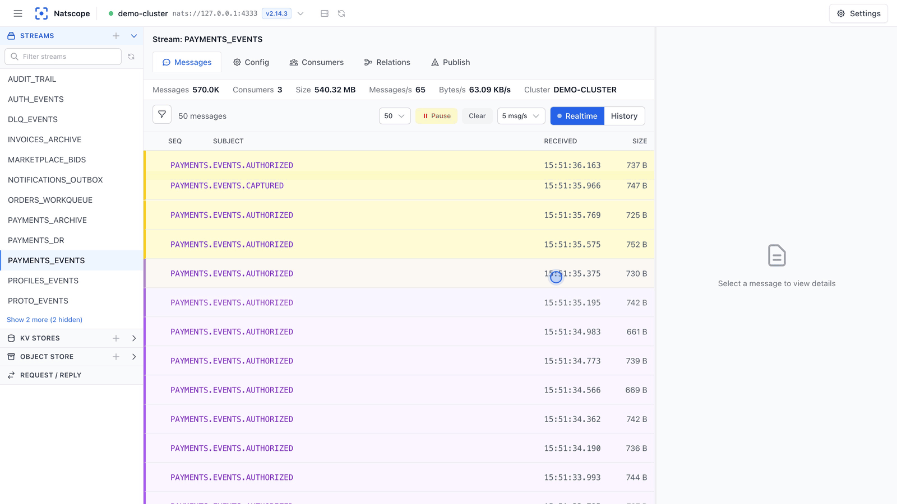

<div align="center">

# Natscope

**A web UI for NATS JetStream that decodes Protobuf payloads.**

[](https://github.com/dmit-4884/natscope/releases)
[](https://github.com/dmit-4884/natscope/actions/workflows/ci.yml)
[](LICENSE)



**[Documentation](https://natscope.app)** · [Demo in 1080p](docs/demo/natscope-demo-1080p.mp4)

</div>

- Natscope ships as one binary with the UI inside and keeps its state in a single local file.
- Point it at your `.proto` files and binary payloads show up as JSON in history, live tail and publish.
- Browse, edit and purge streams, pause consumers, manage Key/Value buckets and object stores.
- Credentials go to the OS keychain or an encrypted file vault, apart from the database.
- Claude Code or Cursor can read your streams over MCP, with payloads decoded.

## Install

```bash
brew install dmit-4884/tap/natscope
natscope
```

```bash
docker run -d -p 127.0.0.1:4280:4280 -v natscope-data:/data ghcr.io/dmit-4884/natscope:latest
```

Open <http://localhost:4280> and add a connection. Natscope binds to loopback; read
[remote access](https://natscope.app/reference/remote-access) before you open it to a network.

[Configuration](https://natscope.app/reference/configuration) · [Building from source](CONTRIBUTING.md) ·
[Apache 2.0](LICENSE)
